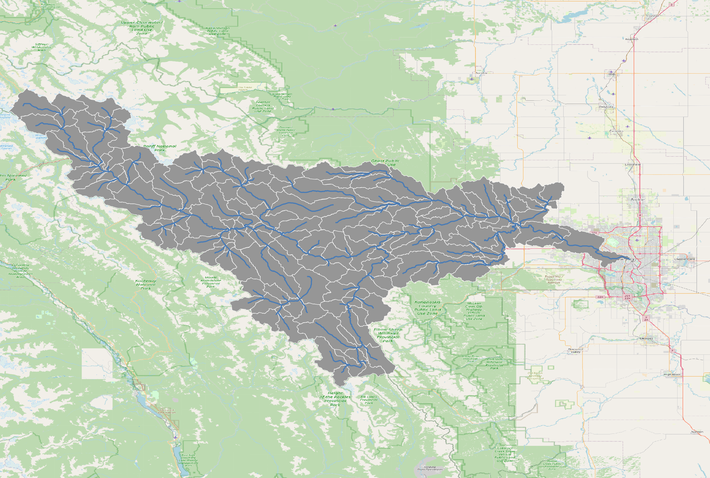

# Training session to set up MESH for the Bow River at Calgary catchment


Launching MyBinder Session: [](https://mybinder.org/v2/gh/kasra-keshavarz/maf-env-basic.git/HEAD)

# Library requirements
## General
Certain libraries and binary executables are necessary to run the
workflows in this repository. Below necessary libraries for general usage
are mentioned:
```console
1. CDO (Climate Data Operators >=v2.2.1),
2. ecCodes (>=v2.25.0),
3. Expat XML parser (>=v2.4.1),
4. GDAL (>=3.5.1),
5. GEOS (>=3.10.2),
6. HDF5 (>=1.10.6),
7. JasPer (>=2.0.16),
8. libaec (>=1.0.6),
9. libfabric (>=1.10.1),
10. libffi (>=3.3),
11. libgeotiff (>=1.7.1),
12. librttopo (>=1.1.0),
13. libspatialindex (>=1.8.5),
14. libspatilite (>=5.0.1),
15. netcdf-fortran (>=4.5.2),
16. netcdf (>=4.7.4),
17. postgresql (>=12.4),
18. proj (>=9.0.1),
19. python (>=3.10.2),
20. sqlite (>=3.38.5),
21. udunits (>=2.2.28)
```
Each of the above libraries and binaries may need further dependencies. It
is up to the user to assure all requirements are satisfied. Most GNU/Linux
distributions should be able to offer all the libraries above through
their remote package repositories. If not, it is recommended to compile
and store them for future reference. In the relevant
[](https://mybinder.org/v2/gh/kasra-keshavarz/maf-env-basic.git/HEAD)
session, these packages are pre-installed and available for testing.

## University of Calgary's ARC HPC
Fortunately, all the above requirements are available on ARC.
You may load the modules with the following command:
```console
# first activating Ucalgary's Computational Hydrology's customized moduled system
. /work/comphyd_lab/local/modules/spack/2024v5/lmod-init-bash
module unuse $MODULEPATH
module use /work/comphyd_lab/local/modules/spack/2024v5/modules/linux-rocky8-x86_64/Core/
# activating modules needed for this workshop
module load \
  gcc/14.2.0 openssh/9.8p1 python-venv/1.0 py-xarray/2024.7.0 \
  py-traitlets/5.14.3 py-asttokens/2.4.0 htop/3.3.0 slurm/24.11.0-1 \
  antlr/2.7.7 py-cdo/1.5.6 py-comm/0.1.4 py-executing/1.2.0 \
  glibc/2.28 ucx/1.17.0 gsl/2.7.1 r-rcpp/1.0.12 py-debugpy/1.6.7 \
  py-pure-eval/0.2.2 gcc-runtime/14.2.0 openmpi/4.1.6 nco/5.2.4 \
  r-lattice/0.21-8 py-decorator/5.1.1 py-stack-data/0.6.2 tree/2.1.0 \
  libunistring/1.2 py-numpy/1.26.4 r-sp/1.6-0 py-parso/0.8.3 \
  py-typing-extensions/4.8.0 lz4/1.9.4 libidn2/2.3.7 gdal/3.9.2 \
  r-terra/1.8-10 py-jedi/0.18.2 py-ipython/8.28.0 snappy/1.1.10 \
  nghttp2/1.62.0 geos/3.12.2 r-raster/3.6-20 py-contourpy/1.0.7 \
  py-platformdirs/3.10.0 c-blosc/1.21.5 curl/8.7.1 which/2.21 \
  r-mass/7.3-59 py-cycler/0.11.0 py-jupyter-core/5.3.0 libaec/1.0.6 \
  libjpeg-turbo/3.0.3 r/4.4.1 r-class/7.3-21 py-fonttools/4.39.4 \
  py-pycparser/2.21 hdf5/1.14.3 libtiff/4.6.0 qt/5.15.14 \
  r-proxy/0.4-27 py-kiwisolver/1.4.5 py-cffi/1.16.0 netcdf-c/4.9.2 \
  sqlite/3.46.0 py-mpi4py/4.0.0 r-e1071/1.7-13 py-pillow/10.4.0 \
  py-greenlet/2.0.2 netcdf-fortran/4.6.1 proj/9.4.1 py-six/1.16.0 \
  r-kernsmooth/2.23-20 py-pyparsing/3.1.2 py-zope-event/4.6 \
  openjpeg/2.3.1 fftw/3.3.10 py-python-dateutil/2.8.2 \
  r-classint/0.4-9 py-pyqt5-sip/12.13.0 py-zope-interface/5.4.0 \
  eccodes/2.34.0 libmd/1.0.4 py-pytz/2023.3 r-dbi/1.1.3 \
  py-pyqt5/5.15.9 py-gevent/23.7.0 openssl/3.3.1 libbsd/0.12.2 \
  py-tzdata/2023.3 r-magrittr/2.0.3 py-matplotlib/3.9.2 \
  py-pyzmq/25.0.2 libevent/2.1.12 expat/2.6.2 py-pandas/2.2.3 \
  r-wk/0.7.2 py-matplotlib-inline/0.1.6 py-tornado/6.3.3 \
  numactl/2.0.14 udunits/2.2.28 py-certifi/2023.7.22 r-s2/1.1.2 \
  py-ptyprocess/0.7.0 py-jupyter-client/8.2.0 opa-psm2/11.2.230 \
  util-linux-uuid/2.40.2 py-cftime/1.0.3.4 r-units/0.8-1 \
  py-pexpect/4.8.0 py-nest-asyncio/1.6.0 krb5/1.21.2 cdo/2.4.3 \
  py-netcdf4/1.6.5 r-sf/1.0-12 py-wcwidth/0.2.7 py-psutil/5.9.5 \
  libedit/3.1-20230828 libffi/3.4.6 py-packaging/23.1 \
  r-exactextractr/0.10.0 py-prompt-toolkit/3.0.43 py-ipykernel/6.29.5 \
  libxcrypt/4.4.35 python/3.11.7 py-setuptools/69.2.0 py-cython/3.0.10 \
  py-pygments/2.18.0;
```

## DRAC Fir HPC (at the Simon Fraser University)
The necessary modules may be loaded with the following command:
```console
module load CCconfig ucc/1.2.0 r/4.4.0 hdf5/1.14.2 jasper/4.0.0 \
  libgeotiff/1.7.1 postgresql/16.0 gentoo/2023 openmpi/4.1.5 \
  rstudio-server/4.4 netcdf/4.9.2 libaec/1.0.6 hdf/4.2.16 \
  gdal/3.9.1 StdEnv/2023 aocl-blas/5.1 python/3.11.5 fftw/3.3.10 \
  eccodes/2.31.0 boost/1.82.0 rust/1.85.0 mii/1.1.2 aocl-lapack/5.1 \
  ipykernel/2023b proj/9.2.0 netcdf-fortran/4.6.1 eigen/3.4.0 \
  mpi4py/4.0.3 flexiblas/3.3.1 ipython-kernel/2023b cdo/2.2.2 \
  qt/5.15.11 arpack-ng/3.9.1 gcc/12.3 code-server/4.101.2 \
  jupyterlab-apps/1.0 antlr/2.7.7 freexl/2.0.0 armadillo/12.6.4 \
  hwloc/2.9.1 calibre/8.6.0 scipy-stack/2023b libdap/3.20.11 \
  geos/3.12.0 cfitsio/4.3.0 ucx/1.14.1 libreqda/1.0.1 arrow/14.0.1 \
  gsl/2.7 librttopo/1.1.0 brunsli/0.1 libfabric/1.18.0 flexiblascore/.3.3.1 \
  openrefine/3.9.3 nco/5.1.7 libspatialite/5.1.0 qhull/2020.2 pmix/4.2.4 \
  java/17.0.6 yaxt/0.10.0 udunits/2.2.28 libspatialindex/1.9.3 \
  lerc/4.0.0;
```

# Saving Module Collections
It is recommended to save all load modules as a list to be able to restore
them whenever needed. Using the LMOD features, you may save them with:
```console
module save scimods # you can change "scimods" to anything!
```

And, you may restore the list with:
```console
module restore scimods
```
> [!NOTE]
> Please note that these libraries are necessary
for the Python environment to run smoothly (see below).

# Python requirements
## General
The following list of Python packages are required to run much of the
workflows in this repository. The [requirements.txt](./0-prerequisites/requirements.txt)
file describes the packages necessary to run the workflows.

To download this repository on the `$HOME` directory:
```console
git clone https://github.com/kasra-keshavarz/community-modelling-workflow-training.git $HOME/github-repos/community-workflows
```

You may create Python virtual environments (after assuring all
the modules are loaded) on HPCs, to isolate the environment
to execute the workflows. On HPCs, typically, it is recommended to use
your `$HOME` directory, so a path like the following is recommended:
```console
python -m venv $HOME/virtual-envs/scienv
```

After creating the virtual environment, you can activate the environment
with:
```console
source $HOME/virtual-envs/scienv/bin/activate
```
And your shell prompt, should look like this:
```console
(scienv) foo@bar: ~$ # this is how your HPC will look
```

After the activation of the virtual environment, you may install any
Python package within the environment. To install those we need for
the modelling workflows:
```console
pip install -r $HOME/github-repos/community-workflows/0-prerequisites/requirements_%HPC%.txt
```

> [!IMPORTANT]
> Please replace `%HPC%` with either `arc` or `fir`, depending on
> which HPC you are using.

Once the `scienv` is ready, you may add the virtual environment
to the Jupyter Lab as a kernel using the following command:
```console
python -m ipykernel install --name "scienv" --user
```

Once added as a kernel, you should your virtual environment within your
Jupyter sessions.


Last edited: September 17th, 2025
